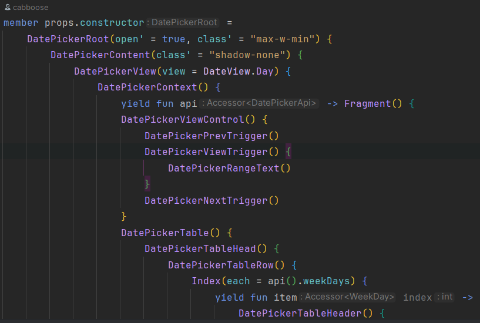

<div id="top"></div>

<br />

<div align="center">
  <a href="https://github.com/shayanhabibi/Partas.Solid" target="_blank">
    
    
  </a>
    
<h3 align="center">Partas.Solid</h3>
  <p align="center">
    <kbd>Solid-JS wrapper in Oxpecker style.</kbd>
  </p>
</div>

<div align="center">

[](https://github.com/shayanhabibi/Partas.Solid/)
[](https://github.com/shayanhabibi/Partas.Solid/)
[](https://github.com/shayanhabibi/Partas.Solid/)

</div>

---

# Docs

[See the new Docs](http://shayanhabibi.github.io/partas-solid-docs/)


---

<!-- TOC -->
* [Install](#install)
  * [Compiling](#compiling)
* [Related Repositories](#related-repositories)
  * [Oxpecker.Solid](#oxpeckersolid)
    * [Differences](#differences)
    * [Reduce undefined behaviour](#reduce-undefined-behaviour)
* [Example](#example)
* [DSL](#dsl)
  * [SolidTypeComponentAttribute](#solidtypecomponentattribute)
    * [Motivation](#motivation)
    * [SolidTypeComponent](#solidtypecomponent)
    * [Properties](#properties)
    * [Aliasing properties](#aliasing-properties)
    * [Accessing Properties in definitions](#accessing-properties-in-definitions)
    * [Spreading properties in descendants](#spreading-properties-in-descendants)
    * [Setting defaults, mergeProps](#setting-defaults-mergeprops)
      * [Risky Business](#risky-business)
  * [Misc magics](#misc-magics)
    * [createContext & useContext](#createcontext--usecontext)
    * [Flattened Arrays in attribute value positions](#flattened-arrays-in-attribute-value-positions)
    * [Passing tags as values](#passing-tags-as-values)
    * [Polymorphism Support](#polymorphism-support)
    * [SolidComponent Attribute](#solidcomponent-attribute)
    * [PartasImport attribute](#partasimport-attribute)
  * [Recipes](#recipes)
    * [Implementing Computation Expressions](#implementing-computation-expressions)
  * [Example:](#example-1)
  * [Conclusion](#conclusion)
* [Dev](#dev)
<!-- TOC -->

# Install

> [!WARNING]
> Requires Fable 5; please install the latest alpha version.

```shell
dotnet add package Partas.Solid
```

```shell
paket install Partas.Solid
```

## Compiling

Fable flags and rationale:

<details>
<summary><code>-e .fs.jsx</code></summary>

Since this is using the Solid-JS framework, you want to ensure you are compiling with the `.jsx` extension. Add the above flag to your Fable build configuration.

</details>

<details>
<summary><code>-c Release</code></summary>


The Fable AST for Debug mode differs from Release mode. This is critical, since the plugin does a lot of heavy transformation, and is developed for Release mode.

This means when Fable compiles in Debug mode (such as when using `watch`), you will get undefined behaviour.

> [!IMPORTANT]
> When using `watch`, add the `-c Release` flag.

</details>

<details>
<summary>If having issues with arrays of integers: <code>--typedArrays false</code></summary>

Fable defaults to using the most performant primitive. This means integer arrays compile to the typed arrays in standard JS.

Libraries like Apex Charts do not expect to receive data in this format, and will reject the input.

You can use strings, `box` or `unbox<obj>` to compile to the plain arrays, or disable typed array compilation using `--typedArrays false` 


</details>

# Related Repositories

Solid-ui (Shadcn port) [Partas.Solid.UI](https://github.com/shayanhabibi/Partas.Solid.UI)

Bindings for different libraries [Partas.Solid.Bindings](https://github.com/shayanhabibi/Partas.Solid.Bindings)

## Oxpecker.Solid

> This is an opinionated fork of [Oxpecker.Solid](https://github.com/lanayx/Oxpecker) that
> keeps the original DSL style, but more aggressively
> transforms F# input to produce correct JSX.
> 
> Please support the original release.


### Differences

The most significant difference to Oxpecker.Solid is:


<details>
    <summary>Aggressive transformation of AST</summary>
<p>

### Reduce undefined behaviour

I feel this iteration has less specific pattern matchers, which prevents what might some deem as undocumented behaviour.

As an example, currently Oxpecker would perform the following conversion:

```fsharp
let mutable show = true

[<SolidComponent>]
let Button () =
    let this = button() {
        "some boiler plate"
    }
    div(class'="MyButton") {
        if show then this else ()
    }
```
```jsx
export let show = createAtom(true);

export function Button() {
    return <button>
        some boiler plate
    </button>;
}
```

As opposed to Partas:

```jsx
export let show = createAtom(true);

export function Button() {
    const this$ = <button>
        some boiler plate
    </button>;
    return <div class="MyButton">
        {show() ? this$ : undefined}
    </div>;
}
```

Using ternary conditional expressions in solid-js works, although there is
also the `<Match>` or `<Show>` tags.
</p>

<p align="right">(<a href="#top">back to top</a>)</p>
</details>

<details>
    <summary>
    Ability to define custom components/tags and use them in the same DSL style
    </summary>

<p>
Partas.Solid provides an extra attribute which can be applied to members of a Tag type definition using `props` as the self identifier. The self identifier, props, allows type safe access to your defined properties which can be set in Oxpecker style.

```fsharp
[<Erase>]
type MyCustomDiv() =
    inherit div()
    [<Erase>]
    member val bordered: bool = jsNative with get,set
    [<SolidTypeComponent>]
    member props.constructor =
    // the props self identifier is a requirement
    // the member name has no influence on output
        div(class' = if props.bordered then "border border-border" else "") { props.children }

[<SolidComponent>]
let App() =
    MyCustomDiv(bordered = true) {
        "Hello world!"
    }
```
</p>

<p align="right">(<a href="#top">back to top</a>)</p>

</details>

---

# Example

See the [Partas.Solid.UI.Playground](https://github.com/shayanhabibi/Partas.Solid.UI) for a comprehensive example of a component library built _ENTIRELY_ in F# using <kbd>Partas.Solid</kbd>, <kbd>Tailwind</kbd> and a host of other libraries like <kbd>TanStack Table</kbd> and <kbd>Kobalte</kbd>.

# DSL

Please see [Oxpecker.Solid](https://lanayx.github.io/Oxpecker/src/Oxpecker.Solid/) documentation for the general explanation of the base DSL.

At any point you can reference how things are done in the [Partas.Solid.UI](https://github.com/shayanhabibi/Partas.Solid.UI) repo to replicate common patterns.

## SolidTypeComponentAttribute

### Motivation

Most framework DSLs in F# share a similar problem. You build a front end using the DSL, but you can't necessarily create components that are as flexible and usable (in the same DSL framework). You end up with a mix of DSL & function calls.

The latter does not, and shouldn't, rationalise the inability to produce your own component library in the DSL, and then USE that library with the same DSL.

---

`Oxpecker.Solid` allows you to define Tags with properties/attributes to interop with libraries or web components. We take this a step further, by scaffolding the type definition with a method call that is compiled into a function (and all Solid-JS components are functions!).

```fsharp
namespace Partas.Solid // !!! Types/Tags must be defined in a module or
                       //     namespace that starts with Partas.Solid.
                       //     This is just to prevent unintentional transformations
open Partas.Solid
open Fable.Core

[<Erase>]
type MyComponent() =
    inherit RegularNode()
    [<Erase>]
    member val customAttribute: int = unbox null with get,set
```

> Here we have defined the custom tag in the Oxpecker style.
> 
> This allows you to utilise it like any other Oxpecker tag `MyComponent(class' = "dummy") { ... }`
> 
> This would fail on runtime since there is no such function or import as `MyComponent`.

**Enter `SolidTypeComponent`**

```fsharp
type MyComponent() =
    // ....
    [<SolidTypeComponent>]
    member props.constructor =
        div()
```

```jsx
export function MyComponent(props) {
    return <div/>
}
```

### SolidTypeComponent

Any type method/member which this attribute is applied to, must have no arguments, and be defined with `props` as the self identifier.

The name of the member has no influence on the output. The compiled name is determined by the name of the type to which the member is attached to.

```fsharp
[<Erase>]
type MyComponent() =
    inherit RegularNode()
    [<SolidTypeComponent>]
    member private props.uncleIro = div()
```

```jsx
export function MyComponent(props) {
    return <div />
}
```

### Properties

Defining custom properties is simple:

```fsharp
[<Erase>]
type MyComponent() =
    inherit RegularNode()
    
    [<Erase>] member val bordered: bool = unbox null with get,set
```

> [!NOTE]
> Ensure you apply Erase to prevent compilation of an empty functor
> 
> jsNative sometimes provides warnings, for this reason I instead bind to `unbox null`. Doesn't make a difference in the end.

### Aliasing properties

If you want to for example: define an alias to `class`, you can do this by defining an inlined member. You can use this to provide named overloads.

```fsharp
[<Erase>]
type MyComponent() =
    inherit RegularNode()
    member this.className
        with inline set(value: string) = this.class' <- value
        and inline get(): string = this.class'
```

### Accessing Properties in definitions

Just use the attached members of the self identifier.

### Spreading properties in descendants

The extension method `.spread` will spread the identifier within the tag.

> [!NOTE]
> There is a pull currently being discussed to perform this action without having to use a stub/noop (Null operation).

If you know Solid-js you might ask:

> Won't this also spread properties we've used elsewhere in the definition?

All property access is automatically split for you. The times where you INTEND to pass the same properties, are far fewer than not. When you do, you can still just manually assign the few properties you've spread anyway.

See the next section for an example.

### Setting defaults, mergeProps

In combination with automatic property splitting, you can also assign properties to generate a `mergeProps`

```fsharp
// -- Program.fs
type [<Erase>] CustomTag() =
    inherit RegularNode()
    
    [<SolidTypeComponent>]
    member private props.typeDef =
    
        props.class' <- "DefaultClass" // setting properties will set the 'default'
        
        div(class' = props.class') {
        
            button().spread(props)
            
        }
```

```jsx
function CustomTag(props) {
    
    props = mergeProps({
        class: "DefaultClass",
    }, props);
    
    const [PARTAS_LOCAL, PARTAS_OTHERS] = splitProps(props, ["class"]);
    
    return <div class={PARTAS_LOCAL.class}>
        
        <button {...PARTAS_OTHERS} bool:n$={false} />
        
    </div>;
}
```

#### Risky Business

For code clarity, you can even define the default in PROXIMITY to the usage, even in a nested tree:

```fsharp
type [<Erase>] CustomTag() =
    inherit RegularNode()
    [<SolidTypeComponent>]
    member private props.typeDef =
        div(){
            div(class' = props.class') {
                props.class' <- "ProximalDefaultDefinition"            
                button().spread(props)
            }
        }
```

```jsx
function CustomTag(props) {
    props = mergeProps({
        class: "ProximalDefaultDefinition",
    }, props);
    const [PARTAS_LOCAL, PARTAS_OTHERS] = splitProps(props, ["class"]);
    return <div>
        <div class={PARTAS_LOCAL.class}>
            <button {...PARTAS_OTHERS} bool:n$={false} />
        </div>
    </div>;
}
```

However, this can also be counter productive to readability etc. If you try to assign the same property twice, then you will receive an error on compilation.

## Misc magics

### createContext & useContext

Frequently described as an anti-pattern, it doesn't mean it shouldn't be supported, as it is frequently used in online examples. The freedom to essentially copy JSX code without too much cognitive load is important.

The plugin supports you creating a context, and then using it as a tag to generate the provider.

```fsharp
// context defined in another module/file
let context = createContext<int>()
// local context definition
let SomeContext = Bindings.createContext<int>()
// Adding the context providers
[<SolidComponent>]
let MyComponent () =
    context(5) {
        context(3) {
            "provider 1"
        }
        SomeContext(10) {
            "provider 2"
        }
    }
```

```jsx
export const SomeContext = createContext();

export function MyComponent() {
    return <context.Provider value={5}>
        <context.Provider value={3}>
            provider 1
        </context.Provider>
        <SomeContext.Provider value={10}>
            provider 2
        </SomeContext.Provider>
    </context.Provider>;
}
```

### Flattened Arrays in attribute value positions

To allow a pattern such as:

```fsharp
div(class' = clsx [| "a1"; "a2"; if someCondition then "a3" else "a4" |])
```

We aggressively unroll the Fable AST in the value position to prevent the formation of toList/toArray, delay and singleton chains. If you know, then you know!

### Passing tags as values

You can pass tags as values in jsx using `!@` prefix operator and then `%` in combination with an anonymous record as a POJO or with a constructor to build the element at the call site.

```fsharp
[<Erase>]
type CustomTag() =
    inherit RegularNode()
    [<Erase>]
    member val icon: TagValue<_> = unbox null with get,set
    [<SolidTypeComponent>]
    member props.constructor =
        props.icon <- !@button
        div() {
            props.icon % {| class' = "KeyVal" |}
            props.icon % {| class' = "KeyVal2" |}
            props.icon % div(class' = "constructor") { button() { "internal" } }
            
        }

[<SolidComponent>]
let Rock () =
    let Comp = !@Imported
    CustomTag(icon = unbox !@a) {
        Comp % Imported(other = unbox !@ModuleTag )
    }
```

```jsx
import { splitProps, mergeProps } from "solid-js";
import { FakeImportedTag } from "fakeLibrary";
import { ModuleTag } from "./TagsAsValuesSimpleTypes.fs.jsx";

export function CustomTag(props) {
    props = mergeProps({
        icon: button,
    }, props);
    const [PARTAS_LOCAL, PARTAS_OTHERS] = splitProps(props, ["icon"]);
    return <div>
        <PARTAS_LOCAL.icon class="KeyVal" />
        <PARTAS_LOCAL.icon class="KeyVal2" />
        <PARTAS_LOCAL.icon class="constructor">
            <button>
                internal
            </button>
        </PARTAS_LOCAL.icon>
    </div>;
}

export function Rock() {
    const Comp = FakeImportedTag;
    return <CustomTag icon={a}>
        <Comp other={ModuleTag} />
    </CustomTag>;
}
```

### Polymorphism Support

Polymorphism is supported when a type interfaces with `type Polymorph = interface end` via the `.as'`, `asChild` extension, or any other library defined extension that routes to an alias prepended with `__PARTAS_POLYMORPHIC__`.

[//]: # (TODO - DOCS)

### SolidComponent Attribute

You can still use the SolidComponent attribute in the same way you would in Oxpecker.Solid. This means no mergeProps/splitProps will be generated by default. You can still spread objects etc, but you will have to manage splitting yourself.

### PartasImport attribute

Pattern discrimination can be more deterministic if we do not dispose the parameter names of builder computations. This discrimination is lost when the `[<Import({selector},{path})>]` attribute is used on types with builder computations defined.

Previously, I had hard coded a pick-up for the supported cases (such as Router, Match etc) where the import was then injected after the fact.

Now, we can instead apply the `[<PartasImport({selector},{path})>]` attribute to achieve the same outcome without AST (therefore pattern discrimination) degredation.

## Recipes

### Implementing Computation Expressions

An example was found when implementing the ArkUI DatePicker.

The DatePicker context components function by passing a function which is given the context methods/api in a reactive signal.

To facilitate this, I define an interface type that takes a type (which would be the interface passed to the children):

```fsharp
namespace Partas.Solid.ArkUI

open Partas.Solid
open Fable.Core

[<Interface>]
type ArkUIContext<'T> =
    inherit HtmlElement
    inherit HtmlContainer
```

I then provide a `Yield` extension method within an `[<AutoOpen>]` module below it with the following signature:

```fsharp
[<AutoOpen>]
module Bindings =
    type ArkUIContext<'T> with
        [<Erase>]
        member inline _.Yield(PARTAS_VALUE: Accessor<'T> -> #HtmlElement): HtmlContainerFun = fun PARTAS_CONT -> ignore PARTAS_VALUE
```

It's important that I've used those specific parameter and argument names, because they are already being picked up in existing patterns.

Now I define the specific context component, and interface with my Context interface:

```fsharp
type DatePickerApi = Glutinum.ZagJs.DatePickerApi
[<Import("DatePicker.Context", datePicker)>]
type Context() =
    inherit RegularNode()
    interface ArkUIContext<DatePickerApi>
```

> [!NOTE]
> Because the computation expression is not *built into the type* itself, I can use the normal Import attribute without issue.

Following this, we should have our type safe lambdas within the builders! Just don't forget to **explicitly** `yield` the `fun`:



## Example:

A comprehensive component and example output:

```fsharp
[<Erase>]
type Sidebar() =
    inherit div()
    member val side: sidebar.Side = unbox null with get,set
    member val variant: sidebar.Variant = unbox null with get,set
    member val collapsible: sidebar.Collapsible = unbox null with get,set
    [<SolidTypeComponentAttribute>]
    member props.constructor =
        props.side <- Left
        props.variant <- sidebar.Sidebar
        props.collapsible <- Offcanvas
        let ctx = Context.useSidebar()
        let (isMobile, state, openMobile, setOpenMobile) = (ctx.isMobile, ctx.state, ctx.openMobile, ctx.openMobile)
        Switch() {
            Match(when' = (props.collapsible = sidebar.None)) {
                
                div(class' = Lib.cn [|
                    "test flex h-full w-[--sidebar-width] flex-col bg-sidebar text-sidebar-foreground"
                    props.class'
                |]).spread props
                    { props.children }
                
            }
            Match(when' = isMobile()) {
                
                Sheet( open' = openMobile(), onOpenChange = !!setOpenMobile )
                    .spread props {
                        SheetContent(
                            class' = "w-[--sidebar-width] bg-sidebar p-0 text-sidebar-foreground [&>button]:hidden",
                            position = !!props.side
                            ).data("sidebar", !!sidebar.Sidebar)
                            .data("mobile", "true")
                            .style'(createObj [ "--sidebar-width" ==> sidebarWidthMobile ])
                            { div(class' = "flex size-full flex-col") { props.children } }
                    }
                
            }
            Match(when' = (isMobile() |> not)) {
                // gap handler on desktop
                div(
                class' = Lib.cn [|
                    "relative h-svh w-[--sidebar-width] bg-transparent transition-[width] duration-200 ease-linear"
                    "group-data-[collapsible=offcanvas]:w-0"
                    "group-data-[side=right]:rotate-180"
                    if (props.variant = sidebar.Floating || props.variant = sidebar.Inset) then
                        "group-data-[collapsible=icon]:w-[calc(var(--sidebar-width-icon)_+_theme(spacing.4))]"
                    else "group-data-[collapsible=icon]:w-[--sidebar-width-icon]"
                |]
                )
                
                div(
                class' = Lib.cn [|
                    "fixed inset-y-0 z-10 hidden h-svh w-[--sidebar-width] transition-[left,right,width] duration-200 ease-linear md:flex"
                    if props.side = sidebar.Left then
                        "left-0 group-data-[collapsible=offcanvas]:left-[calc(var(--sidebar-width)*-1)]"
                    else "right-0 group-data-[collapsible=offcanvas]:right-[calc(var(--sidebar-width)*-1)]"
                    // Adjust the padding for floating and inset variants.
                    if props.variant = sidebar.Floating || props.variant = sidebar.Inset then
                        "p-2 group-data-[collapsible=icon]:w-[calc(var(--sidebar-width-icon)_+_theme(spacing.4)_+2px)]"
                    else "group-data-[collapsible=icon]:w-[--sidebar-width-icon] group-data-[side=left]:border-r group-data-[side=right]:border-l"
                    props.class' 
                |]
                    ).spread props
                    {
                        div(
                            class' = "flex size-full flex-col bg-sidebar group-data-[variant=floating]:rounded-lg group-data-[variant=floating]:border group-data-[variant=floating]:border-sidebar-border group-data-[variant=floating]:shadow"
                        ).data("sidebar", !!sidebar.Sidebar)
                            { props.children }
                    }
            }
            
        }
```

```jsx

export function Sidebar(props) {
    props = mergeProps({
        side: "left", variant: "sidebar", collapsible: "offcanvas",
    }, props);
    const [PARTAS_LOCAL, PARTAS_OTHERS] = splitProps(props, ["collapsible", "class", "children", "side", "variant"]);
    const ctx = Context_useSidebar();
    const isMobile = ctx.isMobile;
    return <Switch>
        <Match when={PARTAS_LOCAL.collapsible === "none"}>
            <div
                class={twMerge(clsx(["test flex h-full w-[--sidebar-width] flex-col bg-sidebar text-sidebar-foreground", PARTAS_LOCAL.class]))}
                {...PARTAS_OTHERS} bool:n $={false}>
                {PARTAS_LOCAL.children}
            </div>
        </Match>
        <Match when={isMobile()}>
            <Sheet open={ctx.openMobile()}
                   onOpenChange={ctx.openMobile}
                   {...PARTAS_OTHERS} bool:n $={false}>
                <SheetContent class="w-[--sidebar-width] bg-sidebar p-0 text-sidebar-foreground [&>button]:hidden"
                              position={PARTAS_LOCAL.side}
                              data-sidebar="sidebar"
                              data-mobile="true"
                              style={{
                                  "--sidebar-width": sidebar_sidebarWidthMobile,
                              }}>
                    <div class="flex size-full flex-col">
                        {PARTAS_LOCAL.children}
                    </div>
                </SheetContent>
            </Sheet>
        </Match>
        <Match when={!isMobile()}>
            <div
                class={twMerge(clsx(["relative h-svh w-[--sidebar-width] bg-transparent transition-[width] duration-200 ease-linear", "group-data-[collapsible=offcanvas]:w-0", "group-data-[side=right]:rotate-180", ((PARTAS_LOCAL.variant === "floating") ? (true) : (PARTAS_LOCAL.variant === "inset")) ? ("group-data-[collapsible=icon]:w-[calc(var(--sidebar-width-icon)_+_theme(spacing.4))]") : ("group-data-[collapsible=icon]:w-[--sidebar-width-icon]")]))}/>
            <div
                class={twMerge(clsx(["fixed inset-y-0 z-10 hidden h-svh w-[--sidebar-width] transition-[left,right,width] duration-200 ease-linear md:flex", (PARTAS_LOCAL.side === "left") ? ("left-0 group-data-[collapsible=offcanvas]:left-[calc(var(--sidebar-width)*-1)]") : ("right-0 group-data-[collapsible=offcanvas]:right-[calc(var(--sidebar-width)*-1)]"), ((PARTAS_LOCAL.variant === "floating") ? (true) : (PARTAS_LOCAL.variant === "inset")) ? ("p-2 group-data-[collapsible=icon]:w-[calc(var(--sidebar-width-icon)_+_theme(spacing.4)_+2px)]") : ("group-data-[collapsible=icon]:w-[--sidebar-width-icon] group-data-[side=left]:border-r group-data-[side=right]:border-l"), PARTAS_LOCAL.class]))}
                {...PARTAS_OTHERS} bool:n $={false}>
                <div
                    class="flex size-full flex-col bg-sidebar group-data-[variant=floating]:rounded-lg group-data-[variant=floating]:border group-data-[variant=floating]:border-sidebar-border group-data-[variant=floating]:shadow"
                    data-sidebar="sidebar">
                    {PARTAS_LOCAL.children}
                </div>
            </div>
        </Match>
    </Switch>;
}

```

## Conclusion

If you like this, please let me know!

I will heavily develop bindings and what not to work with this, but am not motivated to provide documentation/examples without knowing it might help someone.

_Please support the original release [Oxpecker.Solid](https://github.com/lanayx/Oxpecker)_

# Dev

To develop the plugin, ensure you exclude the plugin on compilation:

`fable --exclude Partas.Solid.FablePlugin --noCache -o output -e .fs.jsx --run dotnet restore`

There are a suite of tests to run to help inform if any changes have broken something else.

I've done my best to heavily document the plugin and the method of transformations.

If you are finding a property is not being included in compilation, it likely has not been recognized by the property collection loop. if you add the `--verbose` flag to Fable compilation, you will have a bunch of warnings about what expressions were disposed of in property collection becuase they weren't recognized. This is a good place to start.

When utilising computations/builders, providing parameter names which are exceedingly distinct is advantageous in ensuring targetted transformation.

Similarly, when changing/generating JSX code, use distinct names to prevent ident collisions. This is why I use PARTAS_LOCAL and PARTAS_OTHERS instead of local/others. The names are distinct, they are recognizable, unlikely to collide, and do not obfuscate the output code with meaningless identifiers.
